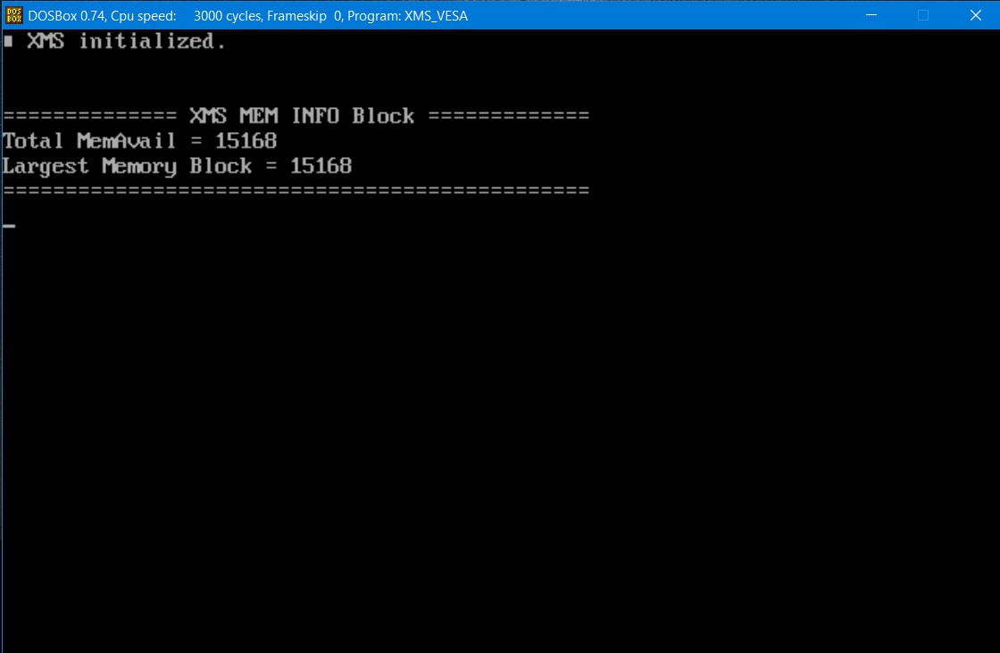
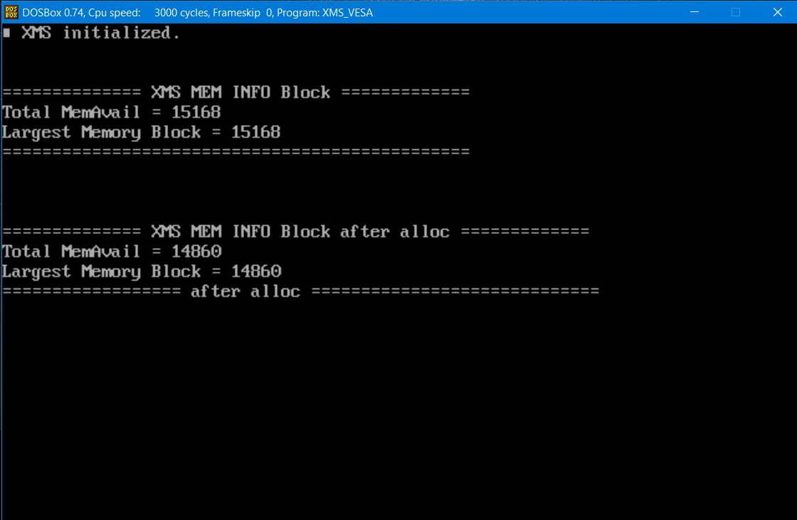
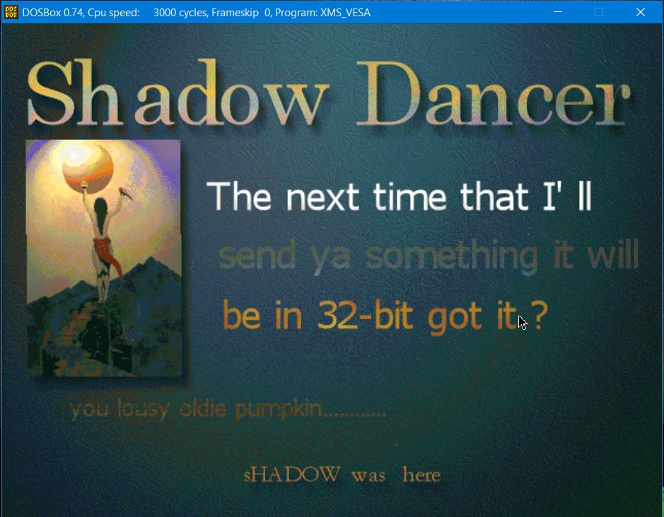

In DOS memory management, extended memory refers to memory above the first megabyte (2^20 bytes) of address space in an IBM PC or compatible with an 80286 or later processor. The term is mainly used under the DOS and Windows operating systems. DOS programs, running in real mode or virtual x86 mode, cannot directly access this memory, but are able to do so through an application programming interface called the Extended Memory Specification (XMS). This library is XMS extender.

